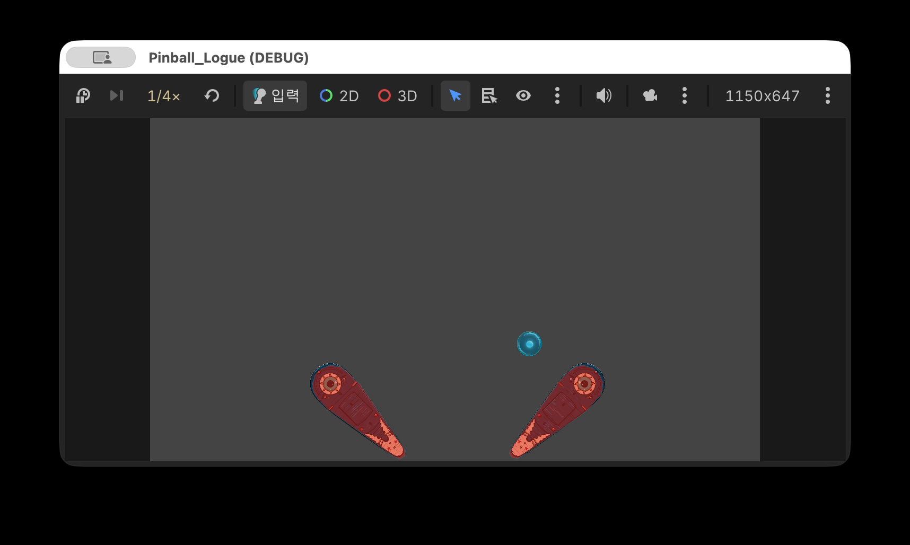
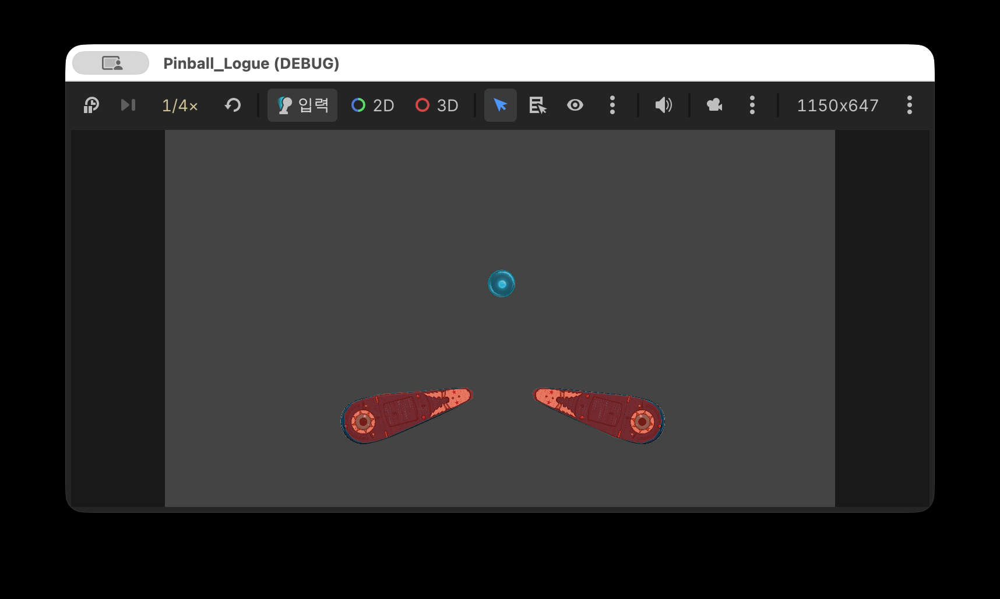
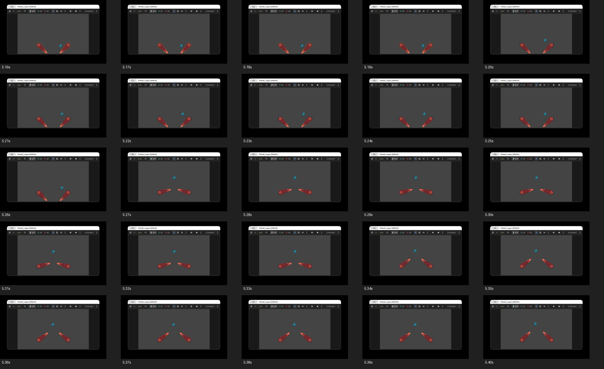
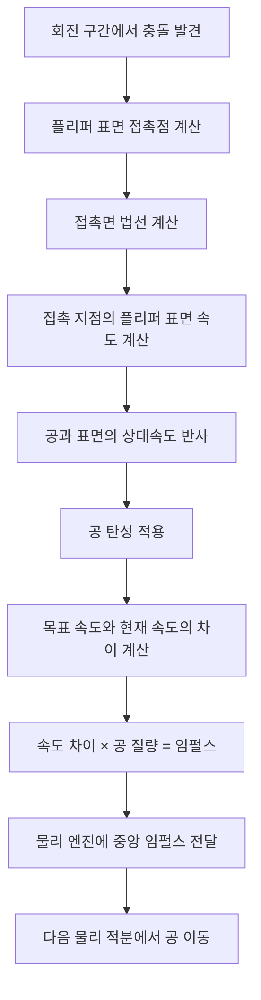

# 플리퍼 충돌 문제 해결 기록

작성일: 2026-08-01  
대상 씬: `scenes/test_flipper.tscn`  
관련 최종 커밋: `afc83ee fix: Apply physical impulse to swept flipper collisions`

## 이 문서의 목적

플리퍼가 빠르게 회전할 때 공이 통과하거나 갑자기 다른 위치로 이동했던 문제를 비개발자 팀원도 이해할 수 있도록 시간 순서대로 정리한다.

여기서 말하는 **터널링**은 빠르게 움직인 물체가 충돌 대상을 검사하지 못하고 그대로 통과하는 현상이다. 카메라가 빠르게 지나간 자동차의 중간 위치를 찍지 못하는 상황과 비슷하다.

---

## 1. 최초 문제: 플리퍼가 공을 통과함

### 문제

- 정지한 플리퍼에는 공이 충돌했다.
- 플리퍼가 작동하는 도중에는 공이 콜라이더를 통과했다.
- 특히 공이 플리퍼의 초기 각도와 목표 각도 사이에 있을 때 재현이 쉬웠다.
- 플리퍼 스프라이트와 충돌 폴리곤의 위치도 일부 어긋나 있었다.

### 분석

Godot 물리는 한 물리 프레임의 시작과 끝 상태를 기준으로 충돌을 처리한다.

플리퍼가 한 프레임에 큰 각도로 회전하면 다음과 같은 빈 구간이 만들어질 수 있다.

```text
이전 프레임: 공과 충돌하지 않음
        ↓ 플리퍼가 큰 각도로 회전
다음 프레임: 이미 공을 지나침
```

스프라이트와 충돌체에 `Scale`이 따로 적용된 점도 실제 표시 크기와 물리 크기를 다르게 만들 수 있었다.

### 대처 방안

1. 플리퍼 물리 노드의 Scale을 `(1, 1)`로 고정했다.
2. 크기 조절값을 충돌 폴리곤의 점 좌표에 직접 반영했다.
3. 좌우 반전 정보도 폴리곤 점에 흡수했다.
4. 한 프레임의 회전 각도를 여러 구간으로 나누어 중간 위치까지 검사하는 **회전 구간 검사**를 추가했다.

### 결과

- 스프라이트와 충돌 폴리곤 정렬 테스트가 통과했다.
- 플리퍼 크기를 바꿔도 물리 Scale은 `(1, 1)`로 유지됐다.
- 하지만 중간 회전 궤도에서 공을 발견한 뒤 처리하는 방식이 아직 자연스럽지 않았다.

---

## 2. 두 번째 문제: 터널링은 막았지만 타격이 인위적으로 보임

### 문제

- 회전 중 공을 놓치는 문제는 줄었다.
- 공이 플리퍼에 맞아 물리적으로 튕긴다기보다 정해진 위치와 방향으로 이동하는 느낌이 났다.
- 플리퍼가 공에 힘을 전달했다기보다 공을 밀어 옮기는 모습에 가까웠다.

### 분석

초기 회전 검사 코드는 충돌한 공을 플리퍼의 진행 방향 앞으로 옮긴 뒤 최소 표면 속도를 넣었다.

이 방식은 터널링 방지에는 도움이 되지만 다음 정보가 빠져 있었다.

- 실제 플리퍼 표면의 접촉점
- 접촉면이 바라보는 방향인 충돌 법선
- 충돌 직전 공의 속도
- 접촉 지점에서의 플리퍼 표면 속도
- 공의 탄성

### 대처 방안

회전 검사 결과에 실제 접촉점과 충돌 법선을 포함했다.

공의 속도는 다음 개념으로 계산하도록 변경했다.

```text
공의 속도 - 움직이는 플리퍼 표면 속도
→ 접촉면 기준 반사
→ 공의 탄성 적용
→ 플리퍼 표면 속도를 다시 더함
```

### 결과

- 공의 기존 가로 방향 속도가 임의의 고정 방향으로 덮어써지지 않았다.
- 움직이는 플리퍼 표면이 공에 추가 속도를 전달할 수 있게 됐다.
- 일반 속도에서는 이전보다 자연스러워 보였다.
- 하지만 1/8 배속으로 확인하자 공이 한 프레임에 이동하는 새로운 문제가 명확히 보였다.

---

## 3. 세 번째 문제: 1/8 배속에서 공의 순간이동 확인

### 문제

느린 화면 기록에서 공이 플리퍼 근처에 있다가 다음 프레임에 위쪽으로 이동했다.

| 5.26초: 플리퍼 근처의 공 | 5.27초: 한 프레임 뒤 이동한 공 |
| --- | --- |
|  |  |

전체 프레임 흐름은 아래 이미지에서 확인할 수 있다. 5.26초와 5.27초 사이의 위치 차이가 특히 크다.



### 분석

회전 구간 검사에서 접촉점을 찾은 뒤에도 다음 처리가 남아 있었다.

```text
최초 접촉점 계산
→ 접촉점을 플리퍼 목표 각도까지 회전
→ 계산된 위치로 공 Transform 직접 변경
→ 물리 보간 초기화
→ 반사 속도 적용
```

즉, 속도 계산은 물리식으로 개선됐지만 공의 위치는 여전히 코드가 직접 바꾸고 있었다.

자동 테스트에서도 이 문제를 완전히 금지하지 않고 최대 약 16px의 위치 보정을 허용하고 있었다. 실제 RED 테스트에서는 공이 `(80, 0)`에서 `(80.45, 5.71)`로 즉시 이동하는 것이 확인됐다.

또한 플리퍼 기본 작동 시간이 짧고 초반이 빠른 Ease Out 곡선을 사용하기 때문에 한 물리 틱의 회전량이 컸다. 1/8 배속은 문제를 새로 만든 것이 아니라 이미 있던 한 프레임 이동을 눈에 잘 보이게 만든 것이다.

### 첫 번째 대처 방안

- 접촉점을 목표 각도까지 함께 회전시키는 로직을 제거했다.
- 최초 접촉면 밖으로만 공을 조금 옮기도록 수정했다.

### 중간 결과

- 한 번에 약 72px 이동하던 보정은 약 6px 수준으로 줄었다.
- 하지만 `RigidBody2D`의 Transform을 직접 변경하는 구조 자체는 남아 있었다.
- 1/8 배속에서는 작은 직접 이동도 여전히 순간이동으로 보였다.

---

## 4. 최종 문제: 작은 위치 보정도 물리 이동은 아님

### 문제

터널링을 막기 위해 공을 조금만 옮기더라도, 플레이어가 보는 결과는 여전히 순간이동이었다.

### 분석

공은 `RigidBody2D`이므로 위치를 코드가 정하는 것이 아니라 물리 엔진이 힘과 속도를 이용해 다음 위치를 계산해야 한다.

따라서 회전 구간 검사의 역할을 다음처럼 제한할 필요가 있었다.

```text
회전 중 놓친 충돌을 발견하고 필요한 힘을 전달한다.
공의 위치는 변경하지 않는다.
```

### 최종 대처 방안

공의 위치와 속도를 직접 덮어쓰는 코드를 제거했다.

최종 처리 순서는 다음과 같다.



핵심 변경은 다음과 같다.

- 충돌 중 `ball.global_position` 변경 제거
- 충돌 중 `reset_physics_interpolation()` 제거
- `ball.linear_velocity` 직접 대입 제거
- `apply_central_impulse(속도 변화량 × 공 질량)` 적용
- 중간 회전 궤도와 목표 각도 충돌을 모두 회전 검사로 보완

---

## 최종 결과

TDD로 다음 조건을 검증했다.

- [x] 회전 충돌 호출 직후 공 Transform 변화 0px
- [x] 임펄스가 다음 물리 틱에서 반사 속도로 변환됨
- [x] 초기·목표 각도 사이의 공을 회전 검사로 발견함
- [x] 목표 각도까지 크게 회전한 경우에도 공을 놓치지 않음
- [x] 실제 `test_flipper` 씬에서 공이 플리퍼를 통과하지 않음
- [x] 1/8 배속에서 충돌 순간 공 Transform 변화 0px
- [x] R 키 공 초기화 기능 유지
- [x] 플리퍼 관련 자동 테스트 전체 통과

기본 공 최대 속력 테스트도 현재 리소스 값인 2000px/s에 맞춘 뒤 전체 자동 테스트 9개가 모두 통과했다.

사용자 수동 검증에서도 기존 상태보다 크게 개선된 것이 확인됐다.

## 최종적으로 달라진 점

| 이전 | 최종 |
| --- | --- |
| 회전 중간의 공을 놓침 | 회전 구간을 나눠 충돌 탐색 |
| 공을 플리퍼 목표 위치로 직접 이동 | 공 위치를 전혀 변경하지 않음 |
| 진행 방향으로 인위적인 속도 보정 | 접촉점·법선·상대속도 기반 반사 |
| 직접 속도 대입 | 질량을 반영한 물리 임펄스 적용 |
| 빠른 화면에서는 문제 확인이 어려움 | 1/8 배속 회귀 테스트로 고정 |

## 다음 작업

순간이동과 터널링 해결을 기준으로 다음 TDD를 진행한다.

1. 접촉 위치를 회전축 기준 0~100%로 계산
2. A/B/C/D 구역 판정
3. 구역별 속도 배율
4. 구역별 각도 보정과 좌우 방향 부호
5. 일반·정확 패링 배율과 최대 속도 제한
6. 같은 충돌의 중복 적용 방지
7. 테스트 씬 체감 조정
